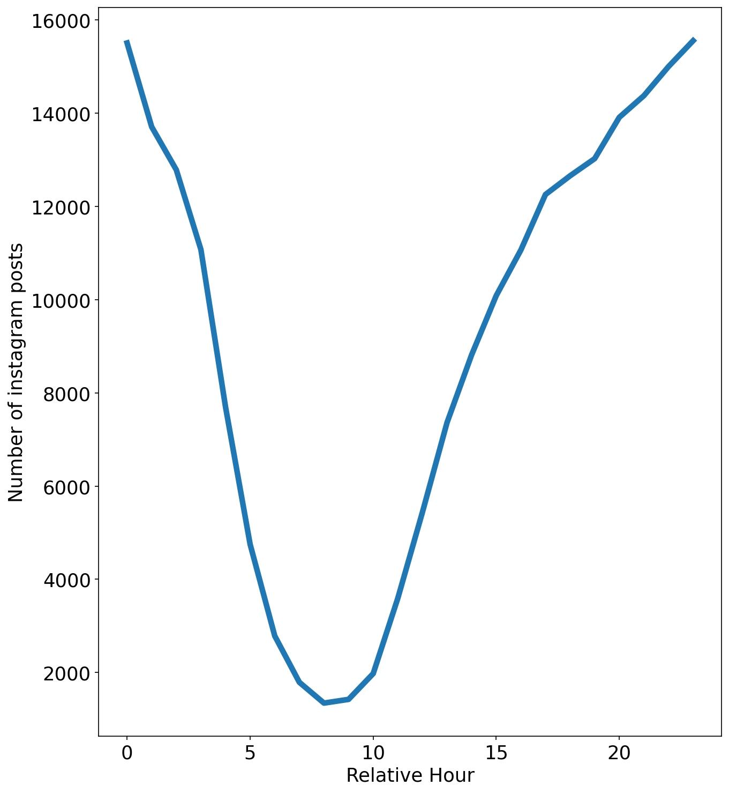
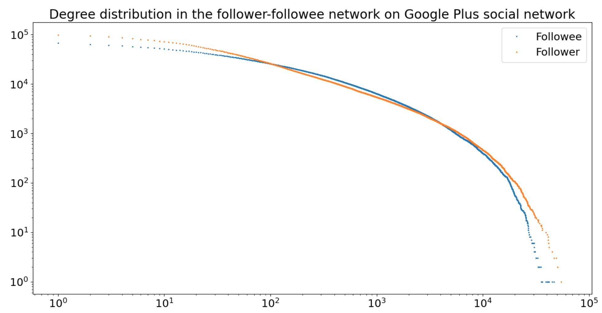

## Testing replicated propositions from Twitter studies on Instagram: generalization of social media user behavior.

### ***Abstract***

On the 10 proposals of social studies of the paper, only 4 are replicated. The authors suggest 'it might be because these propositions reflect the homogeneity of online user behaviors'. Thus the idea is to have a closer look on this statement and test if 3 of the 4 replicated proposals are robust when tested on another social media, here Instagram. As said in paper, we 'Need to retest the robustness of these propositions before we can consider them as universal’. Our goal will be to select these 3 proposals and try to replicate the results from the Twitter social studies.

### Introduction

Here are the source we used for our datasets. The goal of this replication work was to identify whether three of the replicated propositions are also replicable for other social media such as Instagram. Our first proposition was to identify the rythm of Instagram posts. Then we studied the distribution of posts number with respect to the number of followees and followers. Finally, we compared the result of the paper with an Instagram network where interactions are not followers-followees relations but comment/like on each other publications. As our graph was undirected, we decided to study another graph for comparison: a directed network with follower/followee relations on the Google Plus social media.

### Circadian rythm

In order to answer the first question, we need an Instagram dataset containing the hour of posting, therefore this dataset from Github will be used. It contains the time of posting as well as the user ID.
For the second question, we will use another dataset on GitHub containing user ID as well as their number of followers and followees and the number of posts.
For the third question, we will use Huawei Social Network Data, more precisely, the Instagram network consisting of 1000 nodes and 4933 edges

 

 

 
### Attention vs. Productivity

### Followers - Followees network

 

First Header | Second Header
------------ | -------------
Content from cell 1 | Content from cell 2
Content in the first column | Content in the second column
