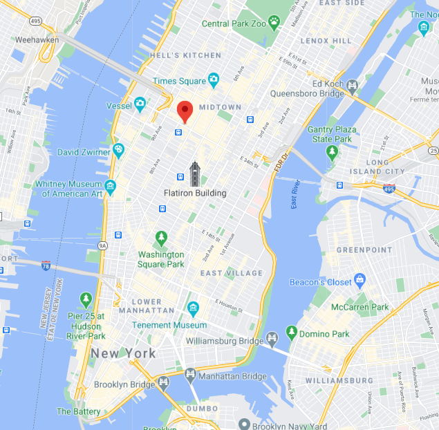
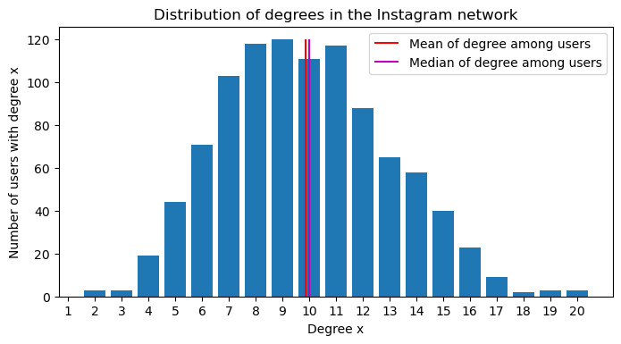
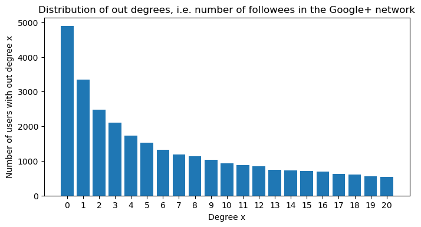
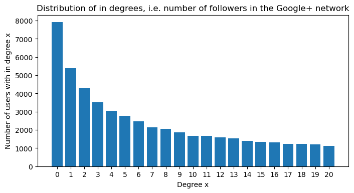
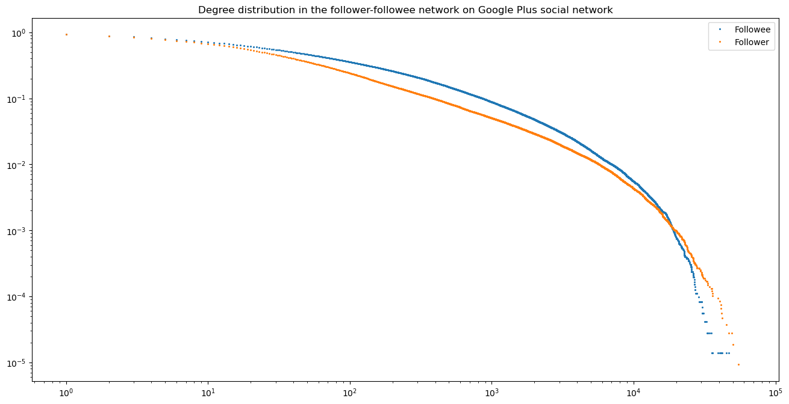

## Testing replicated propositions from Twitter studies on Instagram: generalization of social media user behavior.

### ***Abstract***

Replication is an important process today because of its main interests. The main objective of this article is to cehck 3 proposals, that have already been replicated on the 'Testing Propositions Derived from Twitter Studies' paper, on other social media and to re-test their sustainability. 
Here we choose Instagram. After trying to replicate these proposals on Instagram, we can then check whether we behavior of social media users can be generalized.

### Introduction

Here are the sourcse we used for our datasets. The goal of this replication work was to identify whether three of the replicated propositions are also replicable for other social media such as Instagram. Our first proposition was to identify the rythm of Instagram posts. Then we studied the distribution of posts number with respect to the number of followees and followers. Finally, we compared the result of the paper with an Instagram network where interactions are not followers-followees relations but comment/like on each other publications. As our graph was undirected, we decided to study another graph for comparison: a directed network with follower/followee relations on the Google Plus social media.

### Circadian rythm
The first study consists in attempting to reproduce the circadian rythm that was shown in the article for the twitter post but for instagram. Intuitively, the circadian rythm should be approximatively the same as it is governed by the sleeping cycle of the human being and its work schedule. To reproduce this study a dataset used to test event detection techniques in Instagram has been used [source][1].

The first step was to determine at which time zone the user that uploaded the instrgram post is in order to determine his relative time. With some calculations, it was seen that in fact all the users in the dataset were from the same time zone that was UTC-04:00. Visualizing some of the individuals case by case it was seen that actually the users were all localised in Manhattan :

 

 
 In the image above it is possible to see the position of the user when he posted on instagram. All the other users in the dataset were in the same geographical zone that is Manhattan.
Knowing the time zone of all the users, the circadian rythm of the posts in the dataset can be computed, that is the number of posts in function of the hour. The result is the following : 

 

 
It is possible to see that there are some issues with this reproduction due to the dataset. First of all the hours plotted below are only relative hours with respect to the time of the first post and the day of the week of each post was not possible to be stated. On the other hand, as we anticipated the circadian rythm is quite similar to the one in the article with the tweeter posts. Indeed the hour of posting in Instagram as in Tweeter are influenced by the sleeping habits and the work schedule. By comparison with the circadian rythm of the tweeter post it possible to guess that the minium of the plot obtained has to be situated at around 4:00 AM. 

It is possible to note that as all the users in the dataset were from Manhattan, the difference in the drop or rise rate of posts per hour between the two studies can be due to the fact that all the users were urban. Indeed the population for this study were more present throughout the whole day and earlier in the morning as the rate of rise of the number of posts after its minimum is higher for instagram. 

Another explanation for the difference in the rising trend can also be due to the difference of the social network, it is possible that users are more inclinded to post earlier in the day as it is seen, as Instagram can be somewhat of an imaged blog of daily routines.

Seeing that the general trend of posting hours is respected, it can be concluded that this proposal is robust and can be generalized to any social network.

### Attention vs. Productivity

For this question, we used a dataset from [Github][2] consisting of 348 users. For each user, we have his number of posts, followers and followees on Instagram. Here is an overview of the data value spread:

Feature | Min | 25% | 50% | 75% | Max | Mean | Std
--------| ----| ----| ----| ----| ----| -----|----
#posts | 0 | 15| 65 | 210 | 7'389 | 198 | 517
#followers | 9 | 240 | 577 | 1'483 | 1'533'854 | 158'157 | 1'187'622
#followees | 0 | 231 | 438 | 696 | 7'500 | 712.9 | 1'074.5

As our dataset contains only 348 entries and has a large value range (from 0 to 7'389 for the number of posts, from 9 to 1'533'854 for the number of followers adn from 0 to 7'500 for the number of followees), the values have a large standard deviation, respectively 517, 1'187'622 and 1'074.5 for the number of posts, followers and followees.

In order to frist visualize our data, we plot histograms up to the third quantile of the following values: number of followers, number of followees, number of posts. Going to the third quantile only allow to have a better idea of the data distribution since it avoids the extreme values. For example, the maximum number of followers is 1'187'622 whereas the third quantile is equal to 1'483. So only 25% of the values are greater than 1'483 and form a small long tail.

 

As we may see above, the distributions of the number of followers and the number of posts are left-tailed, whereas the distribution of the number of followees is uniform-like. We can compare the distribution of the number of post with the Figure 1 (A) of our paper. It also shows that the distribution of tweets among users is left-tailed.

Then we realize plots of the number of followers and number of followees agaginst the average number of posts in order to compare it with Figure 3 (A) and (B) of the paper. We also fit a 2-degree polynomial in order to get a trend curve. 

  
  

We can see above that the trend is very stable up to 10^2,8 ~ 631 followees and 10^5 followers. For a greater number of followees and followers, we can noticed that the average number of posts increases with the number of followers as well as with the number of followees. However, it appears that there is no relationship between the average number of posts and the number of followers and followees before that threshold.

This observation is confirmed by the low Pearson correlation values:

#followers | #followees
-----------|-----------
0.33 | 0.10

So there is few chances that there is no linear relation between the average number of posts and the number of followers and followees. 

### Followers - Followees network

First we analyse the mutual relationships on Instagram network from [Kaggle][3]. In order to proceed and visualize our network, we plot the degree distribution:

 

 
 We notice that the distribution is centered on the mean similarly the degree distribution of the Twitter network in the paper as we can see on Figure 4. The degree range in our dataset is 0 to 20 whereas the degree range in the Twitter dataset was from 0 to 10^4 for reciprocal relations so our data is less various with fewer entries (1'000 nodes only).
 
 Then we compute the average local clustering coefficients for each degree from 2 to 20 and plot them. We obtain the following results:
 
 

 

We can see that the average local clustering coefficient for degree = 5 is equal to 0 and equal to 0.006536 for a dregree = 20. In the paper, the Twitter proposal was that the average local clustering coefficient decreases with the degree. We observe here that it is not the case for our Instagram since it increases with the degree up to degree = 18 and then decreases. It suggests that we can not apply the Twitter proposal to our Instagram dataset.

If we analyze then the Google Plus network dataset consisting of 107614 nodes and 13673453 directed edges, we see that the distribution of the in and out degrees are left-tailed, similarly as in the the paper:

 

Then we make a plot for the degree distribution in the follower-followee network:

 

We notice that the trend is less flat then on Figure 4. With our three datasets from Twitter, Instagram and Twitter, we conclude that Instagram and Twitter have a similar degree distribution whereas GooglePlus was much less connected.

### Conclusion

We tried to replicate three proposals of the 'Testing Twitter proposals' paper using different datasets from Instagram. For the first one, a circadian rythm was clearly identified, even if it is slightly shifted to the right. Not surprisingly the circadian rythm can also apply to Instagram. This means users from Twitter and Instagram have a similar posting rythm.

For the second one, the proposal was not replicated on our Instagram dataset. Indeed, having more followers or followees did not imply an increase in posts productivity unless the number of followers or followees is very high. So the posting behavior of users relative to the number of followers and followees is different on Twitter than on Instagram.

For the third question, there is no increase of the average local clustering coefficient with the degree. So the Twitter proposal was not replicated and this could imply a disfferent network distribution for Twitter and Instagram. Finally comparing Twitter and Google Plus, Twitter is much more connected than Google Plus since its distribution of degrees is much more equally spread than the distribution of degrees in Twitter. Comparing these three social media, we can see that the network distribution depends on the social media itself (content type, platform...).

We drew these conclusions however carefully since we used many datasets that we did not scrap ourselves. The datasets may then be biased towards a population (geography, popularity) or a specific timeline: some of the datasets may have been extracted a few years ago and the social media behavior can evolve fast.

[1]: https://github.com/eldersantos/instagram-dataset
[2]: https://github.com/eldersantos/instagram-dataset
[3]: https://www.kaggle.com/andrewlucci/huawei-social-network-data
