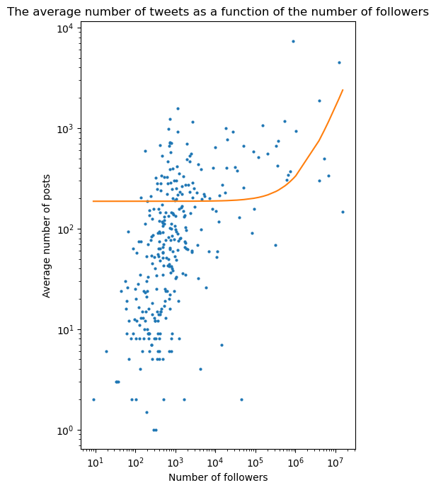

## Testing replicated propositions from Twitter studies on Instagram: generalization of social media user behavior.

### ***Abstract***

On the 10 proposals of social studies of the paper, only 4 are replicated. The authors suggest 'it might be because these propositions reflect the homogeneity of online user behaviors'. Thus the idea is to have a closer look on this statement and test if 3 of the 4 replicated proposals are robust when tested on another social media, here Instagram. As said in paper, we 'Need to retest the robustness of these propositions before we can consider them as universal’. Our goal will be to select these 3 proposals and try to replicate the results from the Twitter social studies.

### Introduction

Here are the source we used for our datasets. The goal of this replication work was to identify whether three of the replicated propositions are also replicable for other social media such as Instagram. Our first proposition was to identify the rythm of Instagram posts. Then we studied the distribution of posts number with respect to the number of followees and followers. Finally, we compared the result of the paper with an Instagram network where interactions are not followers-followees relations but comment/like on each other publications. As our graph was undirected, we decided to study another graph for comparison: a directed network with follower/followee relations on the Google Plus social media.

### Circadian rythm

In order to try to compare the posts rythm of our Instagram dataset [source] with the tweet rythm in the paper, we tried to plot the number of tweets per hour. This task was done by a normalization of time in the dataset. DATA PREPROCESSING? The result was the following:

 

We can see that the rythm of posting is similar to the circadian rythm, except that is it shifted to the right. This means the minimum is ... whereas it was at time ... for the tweet dataset.
We see in the picture below behavior similar to Twitter. We have a shift peak at midnight and then we notice a decrease during the night. In addition, there is an increase in the morning, which evoluate during the day. 
Regarding the days of the week, we could not find the database necessary to study this behavior on a daily basis. 
However, we got similar results to the Twitter data analysis. Thus, we conclude that this suggestion can be generalized for each social network and not specifically for Twitter. 

### Attention vs. Productivity

For this question, we used a dataset from [Github](https://github.com/eldersantos/instagram-dataset) consisting of users.

Feature | Min | 25% | 50% | 75% | Max | Mean | Std
--------| ----| ----| ----| ----| ----| -----|----
#posts | 0 | 15| 65 | 210 | 7'389 | 198 | 517
#followers | 9 | 240 | 577 | 1'483 | 1'533'854 | 158'157 | 1'187'622
#follows | 0 | 231 | 438 | 696 | 7'500 | 712.9 | 1'074.5

In order to frist visualize our data, we ploted histograms up to the third quantile of the following values: number of followers, number of followees, number of posts. Going to the third quantile only allow to have a better idea of the data distribution since it avoids the extreme values. For example, the maximum number of followers is 1'187'622 whereas the third quantile is equal to 1'483. So only 25% of the values are greater than 1'483 and form a small long tail.

 

As we may see above, the distributions of the number of followers and the number of posts are left-tailed, whereas the distribution of the number of followees is uniform-like.

 

 

 
 

 

### Followers - Followees network

 

 
 

 

 

### Conclusion

First Header | Second Header
------------ | -------------
Content from cell 1 | Content from cell 2
Content in the first column | Content in the second column
