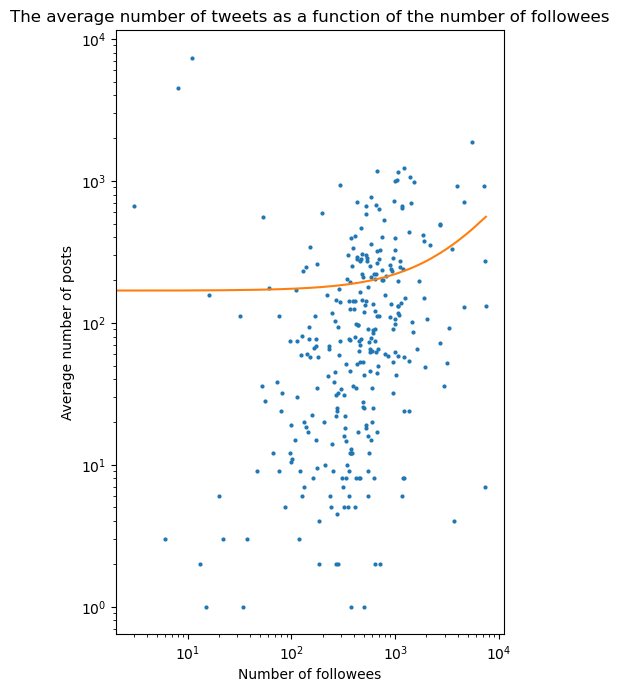

## Testing replicated propositions from Twitter studies on Instagram: generalization of social media user behavior.

### ***Abstract***

Replication is an important process today because of its main interests. The main objective of this article is to validate 3 proposals, that have already been replicated on the Twitter test proposal study, on other platforms and to re-test their sustainability. 
Here we choose Instagram. After replicating this proposals on Instagram, we can generalize it to describe the behavior of social media users.

### Introduction

Here are the source we used for our datasets. The goal of this replication work was to identify whether three of the replicated propositions are also replicable for other social media such as Instagram. Our first proposition was to identify the rythm of Instagram posts. Then we studied the distribution of posts number with respect to the number of followees and followers. Finally, we compared the result of the paper with an Instagram network where interactions are not followers-followees relations but comment/like on each other publications. As our graph was undirected, we decided to study another graph for comparison: a directed network with follower/followee relations on the Google Plus social media.

### Circadian rythm

In order to try to compare the posts rythm of our Instagram dataset [source] with the tweet rythm in the paper, we tried to plot the number of tweets per hour. This task was done by a normalization of time in the dataset. DATA PREPROCESSING? The result was the following:

 

We can see that the rythm of posting is similar to the circadian rythm, except that is it shifted to the right. This means the minimum is ... whereas it was at time ... for the tweet dataset.

First, let's visualize the data we have. In this part we will see if Instagram users follow the circadian rhythm. First of all, we are working on data that only contains the time of publication. In the graph below we can see that the publication rate is similar to that achieved on Twitter. We have a peak shift at midnight and then we notice a decline. In fact, there is an increase in the morning that develops during the day. Around 8 p. m. we can notice a second peak.
However, we cannot replicate this for every day because the required dataset is missing. 
We therefore conclude that this proposal is robust and can be generalized to any social network.

### Attention vs. Productivity

For this question, we used a dataset from [Github](https://github.com/eldersantos/instagram-dataset) consisting of 348 users. For each user, we have his number of posts, followers and followees on Instagram. Here is an overview of the data value spread:

Feature | Min | 25% | 50% | 75% | Max | Mean | Std
--------| ----| ----| ----| ----| ----| -----|----
#posts | 0 | 15| 65 | 210 | 7'389 | 198 | 517
#followers | 9 | 240 | 577 | 1'483 | 1'533'854 | 158'157 | 1'187'622
#followees | 0 | 231 | 438 | 696 | 7'500 | 712.9 | 1'074.5

As our dataset contains only 348 entries and has a large value range (from 0 to 7'389 for the number of posts, from 9 to 1'533'854 for the number of followers adn from 0 to 7'500 for the number of followees), the values have a large standard deviation, respectively 517, 1'187'622 and 1'074.5 for the number of posts, followers and followees.

In order to frist visualize our data, we plot histograms up to the third quantile of the following values: number of followers, number of followees, number of posts. Going to the third quantile only allow to have a better idea of the data distribution since it avoids the extreme values. For example, the maximum number of followers is 1'187'622 whereas the third quantile is equal to 1'483. So only 25% of the values are greater than 1'483 and form a small long tail.

 

As we may see above, the distributions of the number of followers and the number of posts are left-tailed, whereas the distribution of the number of followees is uniform-like. We can compare the distribution of the number of post with the Figure 1 (A) of our paper. It also shows that the distribution of tweets among users is left-tailed.

Then we realize plots of the number of followers and number of followees agaginst the average number of posts in order to compare it with Figure 3 (A) and (B) of the paper. We also fit a 2-degree polynomial in order to get a trend curve. 

  
  

We can see above that the trend is very stable up to 10^2,8 ~ 631 followees and 10^5 followers. For a greater number of followees and followers, we can noticed that the average number of posts increases with the number of followers as well as with the number of followees. However, it appears that there is no relationship between the average number of posts and the number of followers and followees before that threshold.

This observation is confirmed by the low Pearson correlation values:

#followers | #followees
-----------|-----------
0.33 | 0.10

So there is few chances that there is no linear relation between the average number of posts and the number of followers and followees. 

### Followers - Followees network

 

 
 

 

 

### Conclusion

First Header | Second Header
------------ | -------------
Content from cell 1 | Content from cell 2
Content in the first column | Content in the second column
